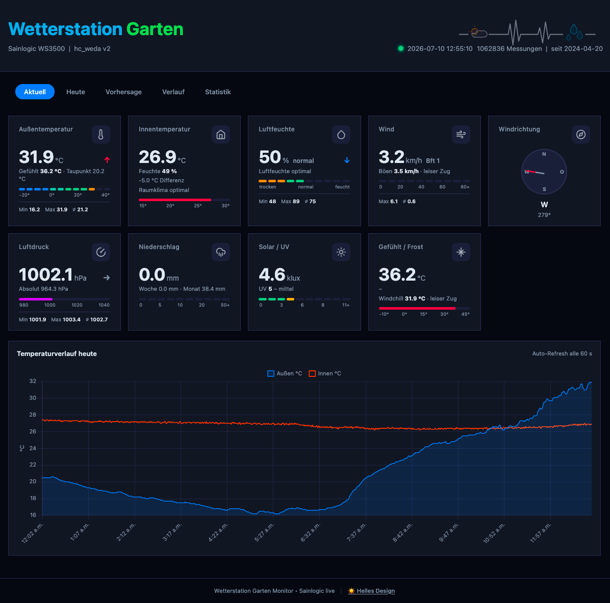

# 🌦️ hc_weda v2

[](https://github.com/zibous/hc_weda/releases)
[](https://github.com/zibous/hc_weda)
[](https://python.org)
[](https://fastapi.tiangolo.com)
[](https://hub.docker.com)
[](https://mqtt.org)
[](https://www.home-assistant.io)
[](https://sqlite.org)
[](https://www.chartjs.org)
[](#)
[](#)
[](#)
[](#)
[](https://www.buymeacoff.ee/zibous)

Wetterstation-Integration für **Sainlogic WS3500** (Ecowitt-Protokoll).
FastAPI-basierter HTTP-Receiver mit Echtzeit-Verarbeitung, SQLite-Langzeitarchiv und Wetter-Warnsystem.



## Features

- 🌡️ **HTTP Receiver** für Wetterstation (Ecowitt-Protokoll)
- 📊 **SQLite Database** mit Tages-Aggregation und Jahres-Archivierung
- 🔄 **MQTT Integration** mit deutschen Feldnamen
- 🏠 **Home Assistant Discovery** + Webhooks
- 📈 **Web Dashboard** mit Zeitreihen, Tagesstatistiken und Vorhersage
- 🔧 **Einheiten-Konvertierung** (Fahrenheit → Celsius, Inches → mm, MPH → km/h)
- 🧮 **Berechnete Werte** (gefühlte Temperatur, Beaufort, Taupunkt, Lüftungsempfehlung)
- ⚠️ **Wetter-Warnsystem** (Sturm, Starkregen, Frost) mit Hysterese
- 🌤️ **Open-Meteo Forecast** (48h Vorhersage, kein API-Key nötig)
- 🗄️ **Daten-Tiering** – 90 Tage Rohdaten, Jahres-Archive, permanente Tagesaggregate
- 🧹 **Nächtlicher Cleanup** – automatische Archivierung um 02:00 UTC
- 📡 **KPI-Endpoint** für zentrales Übersichts-Dashboard
- 🐳 **Docker-ready** mit Graceful Shutdown

## Application Workflow

```
┌─────────────────────────────────────────────────────────────────────────────┐
│                           main.py (Lifespan)                                │
│  1. SQLite init  2. DeviceManager  3. MQTT Discovery  4. Weather Alerts     │
└──────────┬──────────────────────────────────────────────────────────────────┘
           │
           ▼
┌─────────────────────────────────────────────────────────────────────────────┐
│                          FastAPI Server (Port 5045)                         │
├─────────────────┬───────────────────────┬───────────────────────────────────┤
│  Weather        │  Dashboard API        │  KPI / Health                     │
│  Receiver       │  /api/current         │  /api/kpidata                     │
│  /weatherstation│  /api/today           │  /api/health                      │
│  (GET/POST)     │  /api/range           │  /api/devices                     │
│                 │  /api/stats           │                                   │
│                 │  /api/forecast        │                                   │
└────────┬────────┴───────────────────────┴───────────────────────────────────┘
         │
         │  Wetterstation sendet alle 60s
         │  GET /weatherstation?tempf=68.5&humidity=65&...
         ▼
┌─────────────────────────────────────────────┐
│        Sainlogic WS3500 Adapter             │
│  1. Ecowitt-Format parsen (Query-Params)    │
│  2. Validierung (EcowittValidator)          │
│  3. Einheiten konvertieren (F→C, in→mm)     │
│  4. Berechnete Werte (Beaufort, Taupunkt)   │
│  5. WeatherReading erstellen                │
└────────┬────────────────────────────────────┘
         │
         ├──────────────────────────────────────────────────────┐
         │                                                      │
         ▼                                                      ▼
┌─────────────────────┐                          ┌──────────────────────────┐
│  SQLite Database    │                          │  MQTT Broker             │
│  data/weather.db    │                          │  hc_weda/wetterstation/  │
│                     │                          │  (deutsche Feldnamen)    │
│  • measurements     │                          └────────────┬─────────────┘
│  • ~1M Datenpunkte  │                                       │
│  • seit April 2024  │                                       ▼
└─────────────────────┘                          ┌──────────────────────────┐
         │                                       │  Home Assistant          │
         │                                       │  • MQTT Discovery        │
         ├───────────────────────┐               │  • Webhook Events        │
         │                       │               │  • Wetter-Warnungen      │
         ▼                       ▼               └──────────────────────────┘
┌──────────────────┐  ┌──────────────────────┐
│  Web Dashboard   │  │  Weather Alerts      │
│  (Frontend SPA)  │  │  • Sturm (>50 km/h)  │
│  • Zeitreihen    │  │  • Starkregen(>10mm) │
│  • Statistiken   │  │  • Frost (≤0°C)      │
│  • Forecast      │  │  • Hysterese + Cool. │
└──────────────────┘  └──────────────────────┘
         │
         ▼
┌──────────────────────┐
│  Open-Meteo API      │
│  48h Vorhersage      │
│  (30min Cache, free) │
└──────────────────────┘
```

## Wetterstation

- **Modell**: Sainlogic WS3500 (SAINLOGIC HIGH TECH INNOVATION CO., LIMITED)
- **Protokoll**: Ecowitt (HTTP GET mit Query-Parametern)
- **Standort**: Garten (47.4594353, 9.6361833)
- **Sendeintervall**: 60 Sekunden
- **Empfangsport**: 8089 (HTTP Receiver)

## Migration von v1

**WICHTIG**: Vor dem ersten Start v1 Daten migrieren!

```bash
# 1. v1 Backup erstellen
make backup-v1

# 2. Migration ausführen
make migrate

# 3. Migration prüfen
make migrate-check
```

Details: siehe [MIGRATION.md](MIGRATION.md)

## Quick Start

### Lokal (Development)

```bash
# Shared venv aktivieren
source ../.venv/bin/activate

# Dependencies installieren
make install

# Lokal starten (mit auto-reload)
make dev

# In anderem Terminal: Test-Daten senden
make test-receiver
```

### Docker (Production)

```bash
# Image bauen
make build

# Container starten
make up

# Logs anzeigen
make logs

# Status prüfen
make status-app
```

## Ports

| Port | Beschreibung |
|------|-------------|
| **8090** | Dashboard (extern via Docker) |
| **5045** | Dashboard (intern im Container) |
| **8089** | Weather Receiver (Wetterstation → App) |

## API Endpoints

| Endpoint | Methode | Beschreibung |
|----------|---------|-------------|
| `/api/health` | GET | Health Check |
| `/api/devices` | GET | Geräte-Status |
| `/api/current` | GET | Aktueller Messwert |
| `/api/today` | GET | Zeitreihen für heute |
| `/api/today/summary` | GET | Tages-Zusammenfassung (Min/Max/Avg/Trend) |
| `/api/range?from=&to=` | GET | Zeitreihen für Datumsbereich (SQL-Sampling) |
| `/api/stats?from=&to=` | GET | Tages-Aggregation (aus daily_stats Cache) |
| `/api/rain/monthly?from=&to=` | GET | Monatliche Regensummen |
| `/api/forecast?hours=48` | GET | Open-Meteo Vorhersage |
| `/api/dbstats` | GET | Datenbank-Statistiken |
| `/api/cleanup` | POST | Manueller Cleanup + Archivierung |
| `/api/kpidata` | GET | KPI für Übersichts-Dashboard |
| `/weatherstation` | GET/POST | Weather Receiver (Ecowitt) |
| `/` | GET | Dashboard (SPA) |

## Wetterdaten-Empfang

Die Wetterstation sendet alle 60 Sekunden Daten an:

```
http://<server-ip>:8089/weatherstation?tempf=68.5&humidity=65&...
```

Die App:
1. Empfängt die Daten (Ecowitt-Format)
2. Konvertiert Einheiten (Imperial → Metrisch)
3. Berechnet abgeleitete Werte (gefühlte Temp, Beaufort, etc.)
4. Speichert in SQLite
5. Publiziert via MQTT
6. Sendet Webhook an Home Assistant

## MQTT Topics

```
hc_weda/wetterstation/
  ├─ geraete_id
  ├─ geraete_name
  ├─ zeitstempel
  ├─ aussentemperatur_c
  ├─ gefuehlte_temperatur_c
  ├─ luftfeuchte_prozent
  ├─ windgeschwindigkeit_kmh
  ├─ windrichtung_text
  ├─ beaufort_skala
  ├─ luftdruck_hpa
  ├─ regen_tag_mm
  ├─ solarstrahlung_klux
  ├─ uv_index
  └─ ...
```

## Datenbank

- **Datei**: `data/weather.db`
- **Tabelle**: `measurements` (90 Tage Rohdaten, kompatibel mit v1)
- **Tabelle**: `daily_stats` (Tagesaggregate, permanent)
- **Primärschlüssel**: `dateutc` (Zeitstempel)
- **Felder**: Imperial (Rohdaten) + Metrisch (berechnet) + v2 Zusatzfelder

### Daten-Tiering

| Daten | Speicherort | Retention |
|-------|-------------|-----------|
| Rohdaten (1 min) | `data/weather.db` → `measurements` | 90 Tage |
| Tagesaggregate | `data/weather.db` → `daily_stats` | Permanent |
| Archiv pro Jahr | `data/history-YYYY.db` | Permanent |

### Nächtlicher Cleanup (02:00 UTC)

1. `daily_stats` für fehlende Tage aktualisieren
2. Daten älter als 90 Tage → `history-YYYY.db` (Jahres-Archiv)
3. Archivierte Rohdaten aus `measurements` löschen
4. VACUUM bei Bedarf

```bash
# Manuell auslösen
make db-cleanup

# Oder direkt via API
curl -X POST http://10.1.1.119:8090/api/cleanup
```

### Statistiken anzeigen

```bash
make db-stats      # Anzahl, Zeitraum, Größe
make db-latest     # Letzter Messwert
make db-check      # Integrität prüfen
make db-cleanup    # Archivierung + VACUUM
```

## Makefile Commands

### Development
```bash
make dev           # Lokal starten (auto-reload)
make run           # Lokal starten (ohne reload)
make install       # Dependencies installieren
make clean         # Cache-Dateien löschen
```

### Docker
```bash
make build         # Image bauen
make up            # Container starten
make down          # Container stoppen
make restart       # Container neustarten
make logs          # Logs anzeigen (follow)
make shell         # Shell im Container
```

### Database
```bash
make migrate       # v1 → v2 Migration
make migrate-check # Migrations-Status
make backup        # Backup erstellen
make backup-v1     # v1 Backup
make db-stats      # Statistiken
make db-latest     # Letzter Messwert
make db-cleanup    # Archivierung + VACUUM
make db-vacuum     # Nur VACUUM
```

### Testing
```bash
make test-receiver # Test-Daten senden
make status-app    # App-Status prüfen
make health        # Health-Check
```

## Konfiguration

### .env

```bash
# App
APP_NAME=hc_weda
PORT=5045  # Intern (Docker: 5021:5045)

# MQTT
MQTT_BROKER=10.1.1.119
HA_BASETOPIC=hc_weda

# Wetterstation
DEVICE_SAINLOGIC_WS3500_ENABLED=true
DEVICE_WETTERSTATION_HTTP_PORT=8089
DEVICE_WETTERSTATION_HTTP_URL=/weatherstation
```

### config/devices/wetterstation.yaml

```yaml
device:
  name: "Wetterstation Garten"
  type: "sainlogic-ws3500"
  location: "Garten"

datasource:
  type: "http_receiver"
  port: 8089
  url: "/weatherstation"
  format: "ecowitt"

mqtt:
  base_topic: "hc_weda/wetterstation"
  publish_fields:
    temp_c: aussentemperatur_c
    humidity: luftfeuchte_prozent
    # ... (siehe wetterstation.yaml)
```

## Berechnete Werte

Die App berechnet automatisch:

- **Gefühlte Temperatur** (Windchill + Hitzeindex + Solar)
- **Beaufort-Skala** (0-12) mit Text
- **Windrichtung** (N, NO, O, SO, S, SW, W, NW)
- **Taupunkt** (aus Temperatur + Luftfeuchte)
- **Temperatur-Differenz** (Innen/Außen)
- **Lüftungsempfehlung** (basierend auf Temp + Luftfeuchte)
- **Frostwarnung** (bei ≤ 3°C)
- **Solar-Strahlung** (W/m² → Klux)

## Troubleshooting

### Keine Daten von Wetterstation

```bash
# 1. Prüfe ob App läuft
make status-app

# 2. Prüfe Logs
make logs

# 3. Teste Receiver manuell
make test-receiver

# 4. Prüfe Wetterstation-Konfiguration
# → Server-IP: <server-ip>
# → Port: 8089
# → Pfad: /weatherstation
```

### Migration fehlgeschlagen

```bash
# v1 DB prüfen
ls -lh /dockerapps/apps_v1/hc_weda/data/history.db

# Migration erneut ausführen
make migrate

# Status prüfen
make migrate-check
```

### Dashboard zeigt keine Daten

```bash
# Letzten Messwert prüfen
make db-latest

# Health-Check
make health

# Logs prüfen
make logs
```

## Code Quality

```bash
./check.sh          # Prüfen (ruff)
./check.sh --fix    # Auto-Fix
./check.sh --save   # Ergebnis speichern
```

## Architektur

```
hc_weda/
├── app/
│   ├── adapters/
│   │   ├── base.py                    # Basis-Adapter (Abstract)
│   │   ├── sainlogic_ws3500.py        # Wetterstation-Adapter (Konvertierung + Berechnung)
│   │   ├── ecowitt_validator.py       # Eingabe-Validierung
│   │   └── factory.py                 # Adapter-Factory
│   ├── api/routes/
│   │   ├── dashboard.py               # Fassade (bündelt Sub-Router)
│   │   ├── _helpers.py                # Shared Utils (rows_to_series, calc_trend)
│   │   ├── current.py                 # /api/current, /api/today/summary
│   │   ├── history.py                 # /api/today, /api/range
│   │   ├── stats.py                   # /api/stats, /api/rain/monthly
│   │   ├── admin.py                   # /api/dbstats, /api/forecast, /api/cleanup
│   │   ├── weather_receiver.py        # HTTP Receiver (/weatherstation)
│   │   ├── devices.py                 # Geräte-API (/api/devices)
│   │   ├── health.py                  # Health-Check (/api/health)
│   │   └── kpi.py                     # KPI-Endpoint (/api/kpidata)
│   ├── core/
│   │   ├── config.py                  # Zentrale Konfiguration (.env)
│   │   ├── ha_discovery.py            # Home Assistant MQTT Discovery
│   │   ├── logging.py                 # Logging (RotatingFileHandler)
│   │   ├── mqtt.py                    # MQTT Client
│   │   └── webhook.py                 # HA Webhook Client
│   ├── models/
│   │   └── weather.py                 # WeatherReading + DeviceInfo Dataclasses
│   ├── schemas/
│   │   └── kpi.py                     # KPI Pydantic Response Model
│   ├── services/
│   │   ├── queries/                   # DB-Zugriffe gekapselt
│   │   │   ├── current.py             # get_latest, get_today_summary
│   │   │   ├── history.py             # get_today_series, get_range_sampled
│   │   │   └── stats.py              # get_daily_stats, get_monthly_rain
│   │   ├── database.py                # SQLite DB (measurements + daily_stats)
│   │   ├── cleanup.py                 # Nächtliche Archivierung + Scheduler
│   │   ├── device_manager.py          # Geräte-Verwaltung (Config → Adapter)
│   │   ├── weather_alerts.py          # Warnsystem (Sturm, Frost, Regen)
│   │   ├── forecast.py                # Open-Meteo Vorhersage (30min Cache)
│   │   ├── kpi_service.py             # KPI-Berechnung
│   │   └── startup.py                 # App-Start (MQTT Status, Discovery, Webhook)
│   └── main.py                        # FastAPI App + Lifespan
├── config/devices/
│   └── wetterstation.yaml             # Geräte-Config (MQTT-Mapping, Schwellwerte)
├── data/
│   ├── weather.db                     # Haupt-DB (90 Tage + daily_stats)
│   ├── history-2024.db                # Jahres-Archiv 2024
│   ├── history-2025.db                # Jahres-Archiv 2025
│   ├── history-2026.db                # Jahres-Archiv 2026 (laufend)
│   └── history/                       # CSV-Exporte (Legacy v1)
├── frontend/
│   └── static/                        # Dashboard SPA (HTML/JS/CSS)
├── scripts/
│   └── migrate_v1_to_v2.py            # Migrations-Script (v1 → v2)
├── docker-compose.yml
├── Dockerfile
├── Makefile
└── .env
```

## Links

- **Dashboard**: http://10.1.1.119:8090
- **Health**: http://10.1.1.119:8090/api/health
- **Weather Receiver**: http://10.1.1.119:8089/weatherstation
- **MQTT Topic**: `hc_weda/wetterstation`
- **Home Assistant Webhook**: `hc_weda`
- **OpenAPI Docs**: http://10.1.1.119:8090/docs

## Wetter-Warnsystem

Das integrierte Warnsystem überwacht kontinuierlich alle eingehenden Messdaten und sendet bei Schwellwert-Überschreitung Warnungen via Webhook an Home Assistant.

| Warnung | Schwellwert | Severity |
|---------|-------------|----------|
| **Sturm** | Wind > 50 km/h oder Böen > 70 km/h | warning |
| **Starkregen** | Regenrate > 10 mm/h | warning |
| **Frost** | Temperatur ≤ 0°C | warning |
| **Frostgefahr** | Temperatur ≤ 3°C (> 0°C) | info |

**Hysterese-Logik**: Warnungen bleiben mindestens 15 Minuten aktiv. Nach Deaktivierung gilt ein Cooldown von 5 Minuten (verhindert Flapping bei Grenzwerten).

## Open-Meteo Vorhersage

Die App holt stündliche Vorhersagedaten (48h) von der kostenlosen Open-Meteo API:

- **Kein API-Key** erforderlich
- **30-Minuten-Cache** verhindert unnötige Requests
- **Thread-safe** mit Lock bei Cache-Miss
- **Backoff** bei Rate-Limit (5 Min Pause nach HTTP 429)
- **Fallback**: Bei Fehler wird letzter Cache zurückgegeben

Enthaltene Vorhersage-Daten: Temperatur, Luftfeuchte, gefühlte Temperatur, Niederschlagswahrscheinlichkeit, Windgeschwindigkeit, Böen, Bewölkung, Luftdruck, UV-Index.

## Requirements

- Python 3.10+ (getestet mit 3.12)
- MQTT Broker (Mosquitto empfohlen)
- Sainlogic WS3500 oder kompatible Ecowitt-Station
- SQLite 3.25+ (für Window Functions, im Container enthalten)

